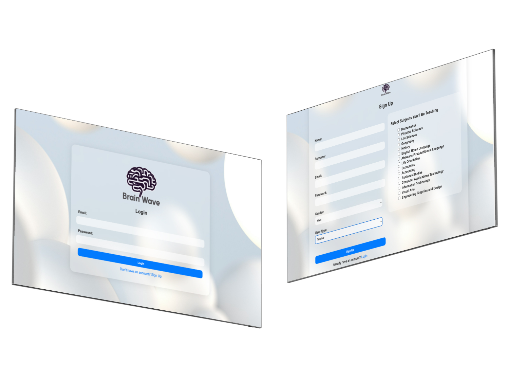

# Brainwave Grade Management System

[→ Watch the demo video here ←](https://drive.google.com/drive/folders/1HpaJh_8Eb3Dw56tw2Le9vLF5eKA1em97)


## Project Overview
DV200 Semester 2. The Brainwave Grade Management & Tracking System is a PHP-MySQL-based web application designed to manage and display student grades across multiple subjects and assignments. 

### Key Features:
- **Admin Panel:** Admin users can manage student and teacher approvals, create and assign subjects, and view details of active students and teachers.
- **Teacher Dashboard:** Teachers can create assignments, view and edit student grades, and track the performance of students for subjects they teach.
- **Student Dashboard:** Students can view their grades in a dynamic, visually appealing manner using charts, and see a breakdown of their grades per subject and assignment.

## Mockups 



## Teck Stack
- **Front-end:** HTML5, CSS (with a frosted glass design), JavaScript
- **Back-end:** PHP
- **Database:** MySQL
- **Charting Library:** Chart.js
- **Server Environment:** XAMPP (Apache, MySQL, PHP)

## Installation Instructions
1. **Download and Install XAMPP:**
   Download XAMPP from https://www.apachefriends.org/download.html and follow the installation instructions for your platform.

2. **Clone the Repository:**
   Clone this repository into the `htdocs` folder of your XAMPP installation:

   ``` 
   git clone https://github.com/RP231013/brainwave
   ```

3. **Start XAMPP:**
Open the XAMPP Control Panel and start both Apache and MySQL services.

4. **Create the Database:**
Import the database schema:
- Open your browser and navigate to ```http://localhost/phpmyadmin```
- Create a new database called `brainwave`
- Import the provided SQL file (brainwave.sql) located in the root of the project.

5. **Configure Database Connection:**  
Update the config.php file with your database credentials:
```
define('DB_SERVER', 'localhost');
define('DB_USERNAME', 'root');
define('DB_PASSWORD', '');
define('DB_NAME', 'brainwave');
```

6. **Access The Application** Once the database and server are set up, you can access the application by navigating to:
```
http://localhost/brainwave
```

## Usage Instructions
### Admin Functionality:
- Manage Users: Admins can approve or decline both students and teachers.
- Manage Subjects: Admins can add and delete subjects and view subject details.
### Teacher Functionality:
- Manage Assignments: Teachers can create assignments and assign them to subjects they teach.
- Manage Grades: Teachers can view, edit, and track student performance across subjects and assignments.
### Student Functionality:
- View Grades: Students can view their grades for all assignments across subjects in a visual chart format.


## Credits
- Chart.js: Used for dynamic graph generation for student grades.

## License 
This project is licensed under the MIT License.